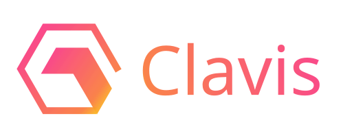
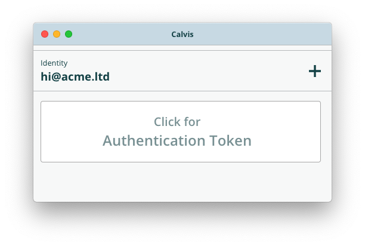

&nbsp;
&nbsp;
&nbsp;

<i>Copyright &copy; Andrew Ying 2019.</i>

Clavis is a simple desktop security key application. It allows you to generate a
public/private key pair and use it to sign JWT tokens for secure authentication
with web services.

## License

Clavis is free software: you can redistribute it and/or modify it under the terms
of version 3 of the [GNU General Public License](LICENSE.md) as published by the
Free Software Foundation. In addition, this program is also subject to certain
additional terms available [here](SUPPLEMENT.md).

This program is distributed in the hope that it will be useful, but WITHOUT ANY
WARRANTY; without even the implied warranty of MERCHANTABILITY or FITNESS FOR A 
PARTICULAR PURPOSE.  See the GNU General Public License for more details.

You should have received a copy of the GNU General Public License along with
this program.  If not, see <https://www.gnu.org/licenses/>.
