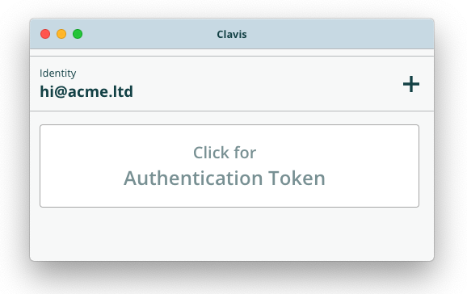

<h1 align="center">Clavis</h1>

<i>Copyright &copy; Andrew Ying 2019.</i>

## License

Clavis is free software: you can redistribute it and/or modify it under the terms
of version 3 of the [GNU General Public License](LICENSE.md) as published by the
Free Software Foundation.

This program is distributed in the hope that it will be useful, but WITHOUT ANY
WARRANTY; without even the implied warranty of MERCHANTABILITY or FITNESS FOR A 
PARTICULAR PURPOSE.  See the GNU General Public License for more details.

You should have received a copy of the GNU General Public License along with
this program.  If not, see <https://www.gnu.org/licenses/>.
